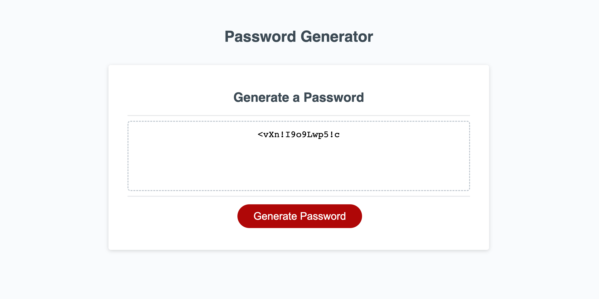

# random-password-generator

## Overview
The application created is a simple password generator used to randomly output a password consisting of 4 criteria choices that the user is able to choose from. These choices ask the user if they would like to include uppercase, lowercase, numbers, and or special symbols in the generation of the password. 
The password also must be between 8 and 128 characters and will throw an error message of these parameters are not met. 

This repository includes the html, css, and javascript files needed in order to properly launch and run the application. 
 
## Accessibility 

* Direct access to deployed application:
    
    https://afbiggs.github.io/random-password-generator/
   
* Access project repository to view entire workflow and indivual documents, images, and or commits.
    
    https://github.com/afbiggs/random-password-generator

    
## Screenshots of Deployed Application 

